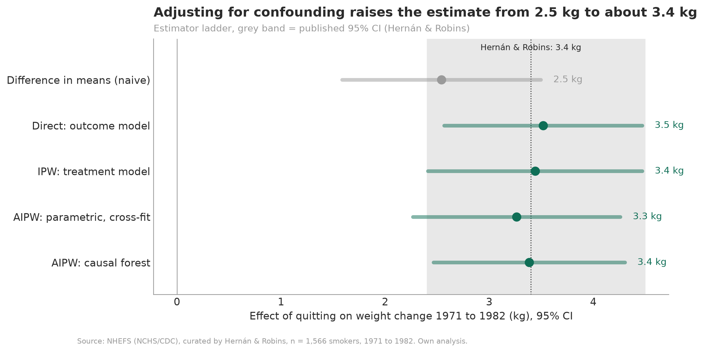
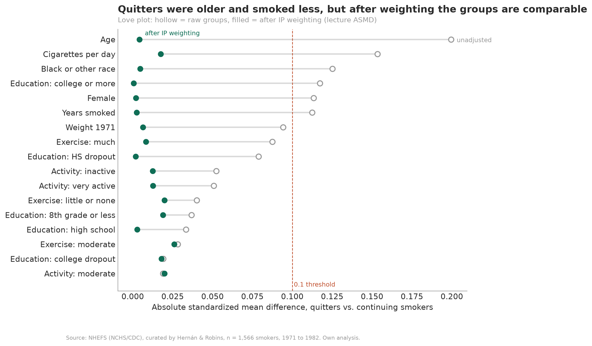
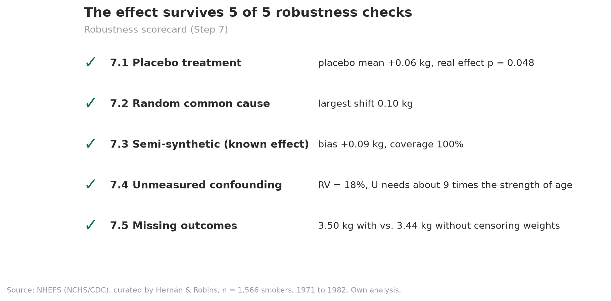

# Causal Inference: Smoking Cessation and Weight Gain

How much weight do smokers gain because they quit? This project answers that with causal machine learning on the NHEFS cohort and checks the result against the published estimate by Hernán and Robins.

`Python` `Causal Inference` `Causal Forest` `EconML` `causallib` `AIPW` `IPW` `Sensitivity Analysis`

> **Quitting smoking causes 3.38 kg of additional weight gain over 11 years (95% CI 2.46 to 4.30).** IPW reproduces Hernán and Robins exactly (3.44 kg), and the effect passes 5 of 5 robustness checks. The data show no reliable difference in the effect between groups of smokers.

---

## Results

| Result | Value |
|---|---|
| Average treatment effect (causal forest, doubly robust) | **3.38 kg** (95% CI 2.46 to 4.30) |
| IPW replication of Hernán and Robins | **3.44 kg** (2.41 to 4.47) vs. published 3.4 kg (2.4 to 4.5) |
| Robustness checks passed | **5 of 5** |
| Effect heterogeneity (CATE) | Not detectable (calibration test β = 0.54, one-sided p = 0.14) |

All estimators on the same 1,566 smokers, effect on weight change from 1971 to 1982 in kg:

| Estimator | Estimate | SE | 95% CI |
|---|---|---|---|
| Difference in means (naive) | 2.54 | 0.49 | 1.59 to 3.50 |
| Direct: outcome model (standardization) | 3.52 | 0.49 | 2.57 to 4.47 |
| IPW: treatment model (stabilized weights) | 3.44 | 0.53 | 2.41 to 4.47 |
| AIPW: parametric nuisances, cross-fit | 3.26 | 0.51 | 2.27 to 4.26 |
| **AIPW: causal forest** | **3.38** | **0.47** | **2.46 to 4.30** |

The naive comparison understates the effect by about a quarter. Quitters were older and heavier at baseline, and both go along with smaller weight gain. Spread over 11 years, the effect is about 0.3 kg per year, which is small next to the health benefits of quitting.

## Why NHEFS

I looked at four datasets. The one I used had to meet five criteria: a real treatment decision, treatment before outcome in time, a published reference value, documented provenance, and not already overused on Kaggle.

| Dataset | Verdict | Reason |
|---|---|---|
| Stroke Prediction (Kaggle) | Rejected | Authenticity and provenance cannot be verified ([Gibson et al. 2026, BMC Medicine](https://doi.org/10.1186/s12916-026-04981-y)) |
| CERN Electron Collision | Rejected | No treatment, so there is no causal effect to estimate |
| Lalonde (NSW job training) | Rejected | Identical to an exercise already covered in the course |
| **NHEFS** | **Selected** | Meets all five criteria |

NHEFS (NHANES I Epidemiologic Follow-up Study, run by NCHS and CDC) meets all five. Participants decided themselves whether to quit. The nine confounders were measured in 1971, before anyone quit, and weight change in 1982. Hernán and Robins report a reference estimate in *Causal Inference: What If*, so the pipeline can be checked against a known answer. The data come from a documented federal survey and rarely show up in Kaggle projects.

## Methodology

The notebook follows the eight steps of the causal ML pipeline from the lecture. The [background document](docs/NHEFS_background_document.docx) explains each step in more detail and contains all tables and appendix figures.

| Step | What was done |
|---|---|
| **1. Research question** | ATE of quitting (1971 to 1982) on weight change, CATE as secondary question. 1,629 smokers, 63 with missing outcome, 1,566 complete cases (403 quitters, 1,163 continuing) |
| **2. Causal structure** | DAG with nine baseline confounders (age, sex, race, education, cigarettes per day, years smoked, exercise, activity, weight 1971). Backdoor criterion checked with networkx. Mediators such as appetite stay out of the adjustment set, so the estimate is a total effect |
| **3. Estimand** | ATE primary, CATE secondary, ATT as fallback if overlap had failed |
| **4. Assumptions** | SUTVA argued. Positivity tested (propensities 0.05 to 0.78). Unconfoundedness argued from the DAG, balance checked after weighting (largest ASMD 0.20 before, below 0.03 after) |
| **5. Fit** | Honest regression forests for the nuisances, causal forest (econml.grf, 2,000 trees, leaf size chosen by R-loss), estimator ladder from naive to AIPW |
| **6. Evaluate** | Calibration test, predicted vs. confirmed effects by quartile, RATE with split-and-score. None of them confirms heterogeneity |
| **7. Robustness** | Placebo treatment, random common cause, semi-synthetic outcome with known effect, sensitivity to unmeasured confounding (Cinelli and Hazlett), IP weighting for censoring |
| **8. Interpretation** | Best linear projection, partial dependence and illustrative profiles. Reported as exploratory only, since Step 6 found no heterogeneity |

## Visualisations

Estimator ladder. All four adjusted estimates fall inside the published 95% CI of Hernán and Robins (grey band). The naive difference in means is too low.



Love plot. Before weighting, quitters and continuing smokers differ most in age and cigarettes per day. After stabilized IP weighting, no standardized mean difference is above 0.03.



Robustness scorecard. An unmeasured confounder would need about 9 times the strength of age to erase the effect.



All 17 figures are in [`figures/`](figures), the key numbers as JSON and CSV in [`results/`](results).

## Reproduce

```bash
git clone https://github.com/JananthanU/causal-inference-smoking-weight
cd causal-inference-smoking-weight
pip install -r requirements.txt
jupyter notebook notebooks/nhefs_causal_ml_pipeline.ipynb
```

Run **Kernel > Restart Kernel and Run All Cells**. A full run takes about 4 minutes. Tested with econml 0.17 and scikit-learn 1.9.

The data come with causallib (`causallib.datasets.load_nhefs`), so there is nothing to download. One seed (42) controls all forests, splits, permutations and bootstraps. The parametric estimates are deterministic. Forest-based secondary values such as the quartile effects or the RATE can move by up to about 0.15 kg on another platform, while the headline numbers above stay the same. Figures are written to `figures/`, the key numbers and an executive summary to `results/`.

## Limitations

- Unconfoundedness cannot be tested. The DAG and the sensitivity analysis (robustness value 18%) support it, but do not prove it.
- Quitting is a compound treatment. Timing, method and relapses are unknown, so consistency only holds approximately.
- Censoring was informative (5.8% of quitters vs. 3.2% of continuing smokers). Weighting for censoring barely changes the result, though (3.50 kg).
- Smoking status and the smoking-related confounders are self-reported and can contain measurement error.
- The data describe US smokers from 1971 to 1982. Products, diets and populations are different today.
- With 1,566 people and a noisy outcome, the null result for heterogeneity means differences are not detectable, not that the effect is the same for everyone.
- The estimate is a total effect. It includes pathways through appetite and metabolism and says nothing about the mechanism.
